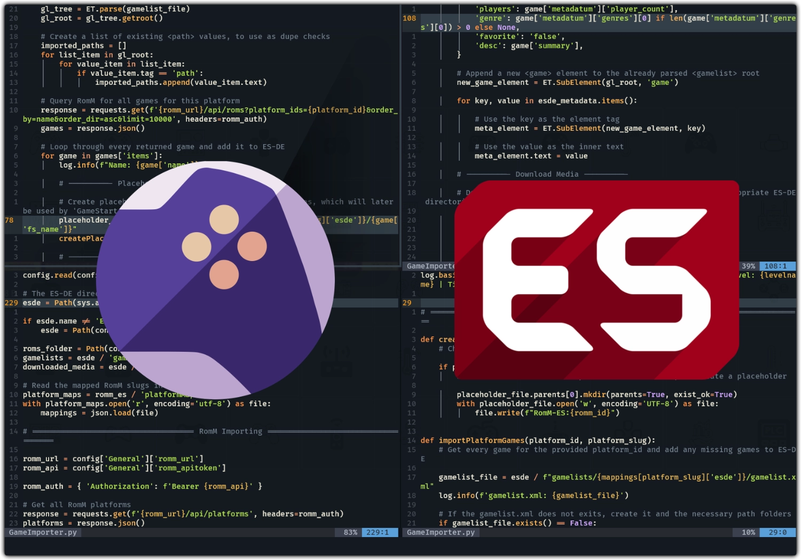

  # ☁️ RomM-ES 🕹️

  

 

This "plugin" for 🕹️ [ES-DE](https://es-de.org/) will allow you to import games from a ☁️ [RomM](https://romm.app/) server into your ES-DE library

Games can be browsed like normal and will be automatically downloaded from RomM to ES-DE the first time they are launched, which means they take up no storage space until you decide to play them

Inspiration for this "plugin" comes from the [RomM Playnite Plugin](https://playnite.link/addons.html#RomM_9700aa21-447d-41b4-a989-acd38f407d9f), which works great and does basically the same thing within Playnite

# 🤖 Dependencies
* [RomM](https://romm.app/)
* [ES-DE](https://es-de.org/)
* [Python 3.10+](https://www.python.org/)
* `pip install -r requirements.txt`

# 🖥️ Setup

1) Enable the ES-DE setting  `Other Settings > Enable Custom Event Actions`
    * The [`game-start`](https://gitlab.com/es-de/emulationstation-de/-/blob/master/INSTALL.md#custom-event-scripts) custom event is what will trigger roms to be downloaded on demand when a game is first started.
      
2) Clone\Download this repo and place the main `RomM-ES` folder into your `ES-DE` data directory, alongside the `gamelists` and `downloaded_media` directories
   
3) Run the `GameImporter.py` script to generate a `settings.ini` file, which will appear in the `RomM-ES` directory. Edit the settings file to include your RomM credentials and `esde_roms` path.
    `python "C:\path\to\GameImporter.py"`
   
4) Move the `GameStart.bat` (windows) or `GameStart.sh` (linux) file to the `ES-DE/scripts/game-start/` directory. Edit the file with the correct paths to call the `GameStart.py` script.
    * If the `game-start` directory does not already exist, simply create it. Scripts in this directory will be triggered when when a game is started in ES-DE but before the emulator is actually launched. This in-between step is when files will be downloaded from RomM.

# 🧭 Instructions

> [!WARNING]
>  Make sure to **exit** ES-DE **before** running the `GameImporter` script.
>
> Importing games using external tools while ES-DE is running can result in undetected changes, overwritten changes, or even corrupted `gamelist.xml` files.

After going through the setup, simply call the `GameImporter.py` script and it will query RomM to begin importing games. For each platform that is queried, the artwork and metadata of every game not already listed in ES-DE will be downloaded and placed into the appropriate ES-DE directories. When you next start ES-DE, your RomM games will have been populated.

 `python ./GameImporter.py`

To download games on demand, simply start a game in ES-DE and and it will be downloaded from RomM using the `GameStart.py` script.

Be aware that ES-DE may appear to stall until the download is complete, which can be noticable with slow connections or large rom files.

# ℹ️ Notes
All metadata is sourced directly from the RomM api and used to create the ES-DE library items.

During the import, byte-sized **placeholder** files will be created in the ROMs directory of ES-DE. These tiny placeholder files are what will allow for on-demand downloading when a game is first launched.

# 📝 TO-DO
* Improved `gamelist.xml` handling
* Archive extractions
* Artwork\Metadata updating
* MixImage uploading from ES-DE to RomM
* More relative paths and streamlined setup
* Go to bed 😩
